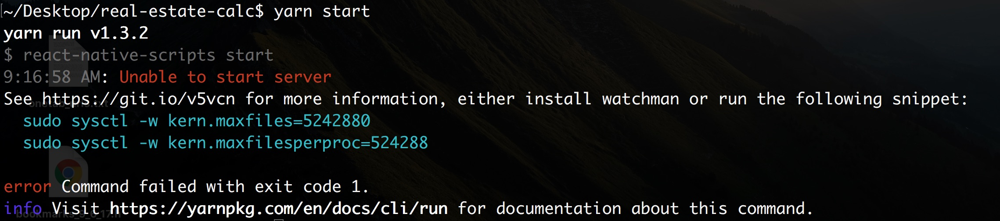
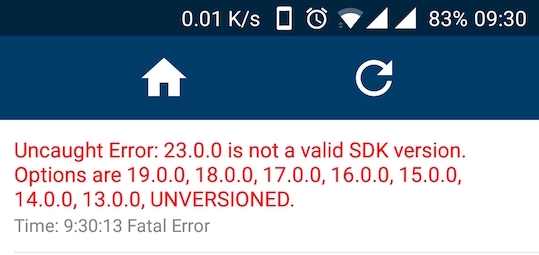

# Recalc
> Advanced calculator for real estate investors

[![NPM Version][npm-image]][npm-url]
[![Build Status][circle-image]][circle-url]

Recalc is an advanced calculator that provide real estate investors an accurate return calculation.


## Development setup

Open your shell in the project directory and run this commands:

```sh
yarn install
yarn start
```

If you get an error like this:



try to run the following:

```sh
brew update
brew install watchman
```

The app should start and you can start an emulator or scan the QR code. To run the app on physical device you should have expo installed.  
  
If you get this error in log:



try to update expo and it should work.

## Release History

* 0.0.1
    * Work in progress

## Meta

Yishai Zehavi – zehaviyishai@gmail.com

Distributed under the MIT license. See ``LICENSE`` for more information.

[https://github.com/zyishai/recalc](https://github.com/zyishai/)

## Contributing

1. Fork it (<https://github.com/zyishai/recalc/fork>)
2. Create your feature branch (`git checkout -b feature/fooBar`)
3. Commit your changes (`git commit -am 'Add some fooBar'`)
4. Push to the branch (`git push origin feature/fooBar`)
5. Create a new Pull Request

<!-- Markdown link & img dfn's -->
[npm-image]: https://img.shields.io/badge/npm-5.5.1-orange.svg
[npm-url]: https://nodejs.org/
[circle-image]: https://circleci.com/gh/zyishai/real-estate-calc.svg?style=shield&circle-token=0d0b929adc6ab61816933a440e26eb3d0a42b6fc
[circle-url]: https://circleci.com/gh/zyishai/real-estate-calc